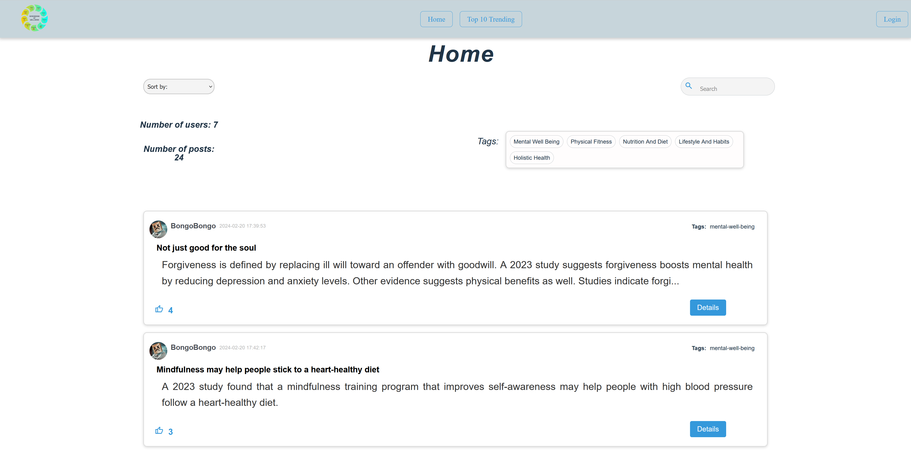
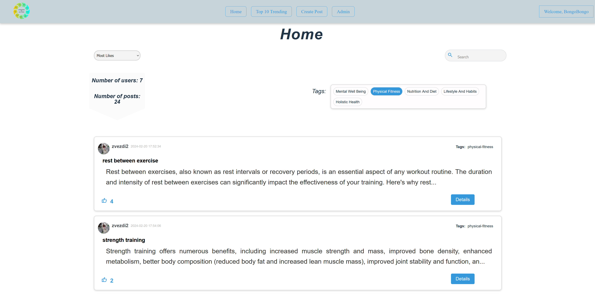
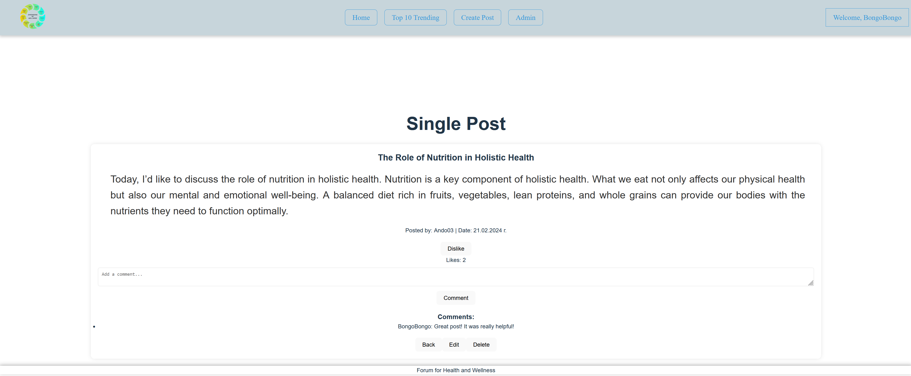
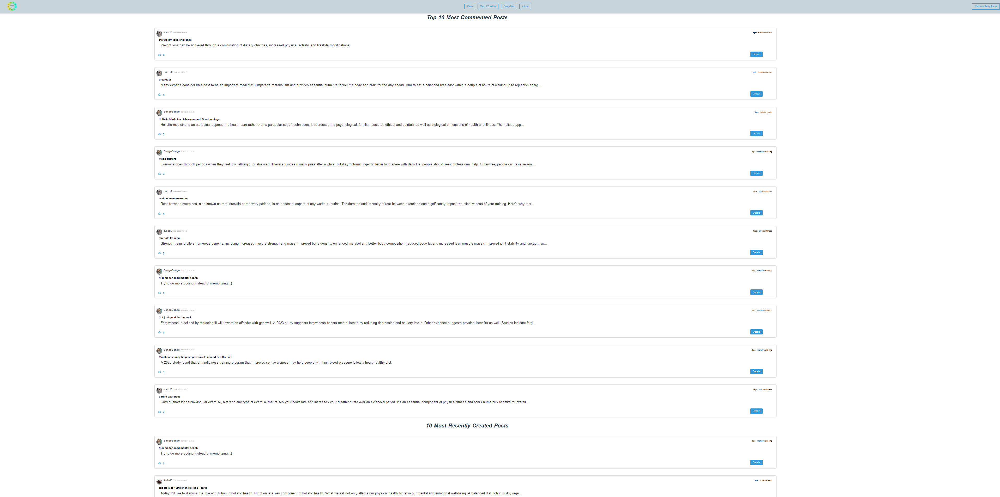
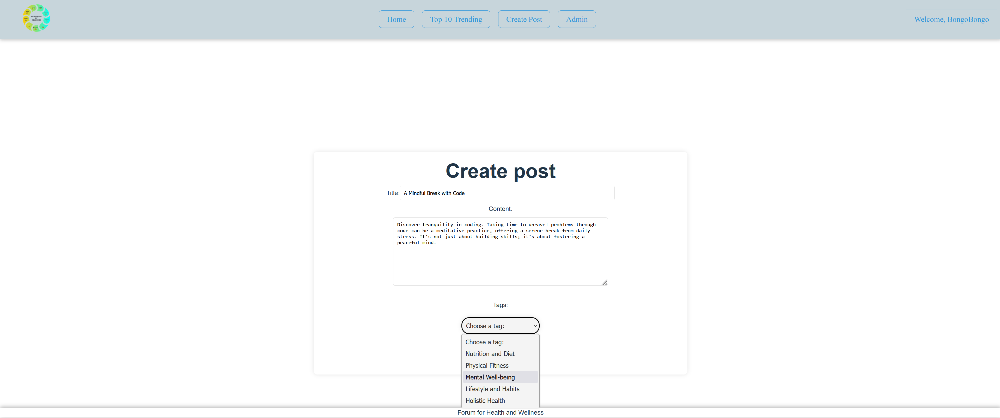
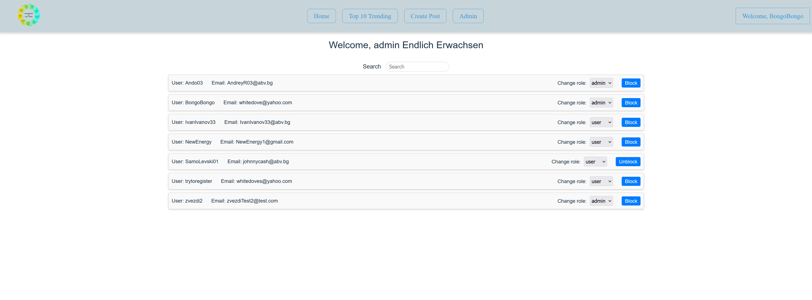
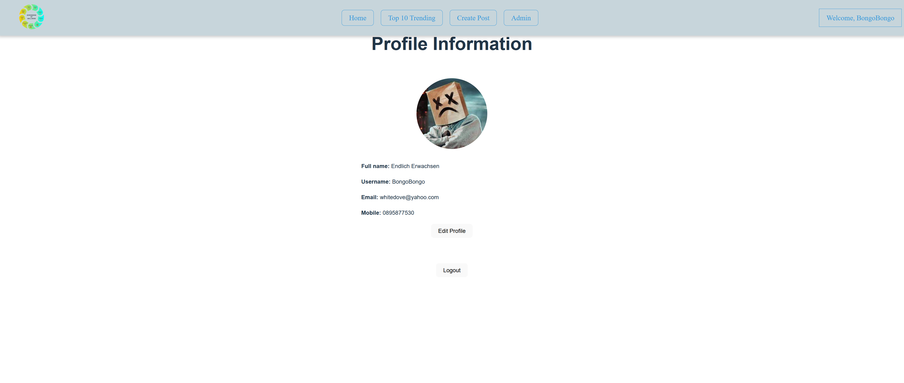

# Health & Wellness Forum

### Description

This Health and Wellness forum is a dedicated space where users celebrate healthy living by sharing insights, engaging in discussions, and valuing contributions through upvotes and comments. Each user could explore topics, sort content, and select tags to dive into a world prioritizing wellness and community support.

### Creators

- Andrey Raychev - [@Andrey-Raychev](https://github.com/Andrey-Raychev)
- Martin Andreev - [@Martin-Andreev-288](https://github.com/Martin-Andreev-288)
- Zvezda Neycheva - [@DreamersJS](https://github.com/DreamersJS)

### Technologies used

- JavaScript
- React
- HTML
- CSS
- Firebase
- ESLint
- git

### Instalation

```
npm install
```

### Run the application

```
npm start
```

### Usage

- **Public part: Explore the Pulse of Health & Wellness Forum**
  <br />In the forum's public view, visitors can browse, sort, and search through all posts, including the top 10 trending topics, filtering by tags for tailored exploration. View real-time stats on users and posts. Interactions and deeper insights prompt a seamless sign-in or sign-up process for full engagement.


<br/>

- **Home for Members**
  <br />Upon login, the forum members are welcomed to a dynamic space where they not only explore, sort, and search posts but also dive deep into discussions. With the ability to react to posts and access detailed insights, users enjoy a richer, interactive experience, fostering meaningful health and wellness conversations.

 
 <br />

- **Deep Dive into Discussions**
  <br />Clicking "details" on any post within the Health & Wellness Forum reveals the full story, inviting users to read extended content and contribute their thoughts through comments. Administrative privileges, such as editing and deleting posts, are enabled for users with admin status.


<br/>

- **Explore What's Trending**
  <br />The Top 10 Trending page showcases the pulse of the Health & Wellness Forum, featuring two dynamic lists: the most commented posts and the most recently created posts. Accessible to everyone, this space highlights the forum's most engaging and current discussions.


<br/>

- **Craft Your Contribution**
  <br/>Embark on post creation by selecting a captivating title and drafting insights or experiences in the content section. Enhance discoverability by optionally tagging the post, guiding it towards like-minded members of the Health & Wellness Forum.


<br/>

- **Admin Panel: Empowering Forum Management**
  <br/>Exclusive to administrators, the Admin Panel serves as the command center for maintaining the Health & Wellness Forum's integrity and user experience. Admins wield the ability to search for users, toggle their roles between admin and user, and enforce forum participation rules by blocking or unblocking access as necessary.


<br/>

- **Personalize the Forum Experience**
  <br/>The Profile Information page enables users to express individuality and manage forum presence. Uploading a profile image adds a personal touch, while editing profile details ensures information remains current. The logout option is also provided for privacy and security within the Health & Wellness Forum.


<br/>

### Test Accounts:

- User:
  - email: johnnycash@abv.bg
  - pass: 123456
- Admin:
  - email: whitedove@yahoo.com
  - pass: 123456
